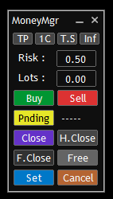

# Money Management Expert Advisor (MQL5)

A lightweight **Money Management Expert Advisor** for MetaTrader 5, designed for manual trade management with low resource usage.

## Features

- Opens and closes any **market execution** or **pending** orders  
- **Breakeven**, **close**, or **half-close** the last position  
- **Full close** all orders and positions  
- Supports **fixed Risk:Reward TP** or **manual TP via line**  
- Allows **per-position risk** settings
- Includes **one-click** trading
- Supports **trailing stop loss**
- Lets you move, minimize, and maximize the interface
- Optimized for **low resource usage** while maintaining high performance  
- Does **not auto-open or auto-modify** positions - all orders are user-controlled  

## About

This Expert Advisor is built for traders who want precise control over trade management without automated entry logic. It focuses on executing your actions quickly and efficiently while keeping the terminal lightweight.

## Requirements

- MetaTrader 5  
- MQL5-compatible broker/account  
- Proper trading permissions enabled  

## Usage

- Attach the EA to any chart  
- Use the panel to manage orders and positions manually  
- Set your preferred risk, TP, and close management options  
- Execute actions directly from the EA interface

## Disclaimer

Trading involves risk. Use this EA on a demo account first to test functionality and behavior before using it on live funds.

## License

This project is licensed under the **GNU General Public License v3.0**. See the [LICENSE](LICENSE) file for details.
